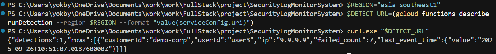

## Security Log Monitoring System (GCP)

Turn raw security events into actionable alerts. This project ingests logs, detects brute‑force behavior, and notifies anomalies via Email. All built on fully managed GCP services.

### Why this project?
- Cloud‑native, serverless pipeline end‑to‑end (zero infra to manage)
- Real‑time ingestion and near‑real‑time detection at scale
- Extensible rules and alerting providers (email via Gmail SMTP; swap in others)

### High‑level architecture


### Data flow (detection window)


### Features
- Ingestion API (Cloud Run) with JSON validation and enrichment
- Durable buffering via Pub/Sub
- BigQuery storage with typed schema
- Brute‑force detection (threshold + sliding window)
- Email alerts via Gmail SMTP (App Password)

### Tech stack
- Cloud Run, Pub/Sub, Cloud Functions (Gen2), BigQuery, Cloud Scheduler
- Node.js (Express), Python generator, Nodemailer (Gmail SMTP)

### Repository structure

```
ingest-api/                 # Cloud Run: Express ingestion service
functions/
  ├─ pubsubToBigQuery/      # CF Gen2: Pub/Sub -> BigQuery inserter
  └─ checkAndAlert/         # CF Gen2: Detection + email alerts
bigquery/
  └─ schema.json            # BigQuery table schema
generator/
  └─ generator.py           # Load generator (failed logins burst)
```

### Demo
1) Ingestion: run the generator to send random login events to API_URL. HTTP 202 means accepted/queued.


2) BigQuery: query the latest rows from security.logs to confirm data was delivered from Pub/Sub to BigQuery successfully.


3) Detection: trigger the function to show JSON results immediately (instead of waiting for Cloud Scheduler which runs automatically every 5 minutes).


4) Alerts: email sent when failed-logins exceed the threshold in the time window.


### Quick start (local demo)
1) Run the API locally
   - `cd ingest-api && npm install && node index.js`
   - Health check: `curl http://localhost:8080/health`
2) Send sample events
   - PowerShell: `$env:API_URL="http://localhost:8080/api/logs"; py generator\generator.py`
   - Expect many `202 {"status":"queued"}` responses

Note: Local run skips waiting on Pub/Sub for responsiveness; full pipeline requires GCP deploy.

### API endpoint and payload format
- Base URL (Cloud Run): `https://ingest-api-ldtpchdt5q-as.a.run.app`
- Main ingest endpoint (The API that accepts logs): `POST https://ingest-api-ldtpchdt5q-as.a.run.app/api/logs`

Payload schema (required fields)
- `customerId` (string)
- `userId` (string)
- `event` (string; e.g., `login_failed`, `login_success`)
- `ip` (string; IPv4/IPv6)
- `device` (string; e.g., `web`, `mobile`)

Optional fields
- `eventTime` (RFC3339 timestamp; default server time if omitted)
- `metadata` (object; free-form key/values)

Sample payloads
```json
{
  "customerId": "demo-corp",
  "userId": "user1",
  "event": "login_failed",
  "ip": "1.2.3.4",
  "device": "web",
  "eventTime": "2025-09-25T15:41:31Z",
  "metadata": {"ua": "Chrome/127", "geo": "TH"}
}
```
```json
{
  "customerId": "demo-corp",
  "userId": "user2",
  "event": "login_success",
  "ip": "5.6.7.8",
  "device": "mobile"
}
```

Sample cURL
```bash
curl -X POST "$API_URL/api/logs" \
  -H "Content-Type: application/json" \
  -d '{
    "customerId": "demo-corp",
    "userId": "user1",
    "event": "login_failed",
    "ip": "1.2.3.4",
    "device": "web"
  }'
```

### Environment variables
- Cloud Run (ingest-api)
  - `PUBSUB_TOPIC` (default `security-logs`)
- Functions: pubsubToBigQuery
  - `BQ_DATASET`, `BQ_TABLE`
- Functions: runDetection
  - `BQ_DATASET`, `BQ_TABLE`, `BQ_LOCATION` (must match dataset location)
  - `FAILURE_THRESHOLD` (default 5), `WINDOW_MINUTES` (default 5)
  - Gmail: `GMAIL_USER`(email send from), `GMAIL_PASS` (App Password), `GMAIL_TO`(email send to)

### Roadmap (SOON TO BE DEVELOP)
- API keys per tenant, key rotation, rate limiting
- Tenant store (contacts, thresholds, data region)
- Looker Studio dashboard template and hosted portal
- Secret Manager for all credentials
- CI/CD, staging/prod, SLOs and oncall alerts

### Troubleshooting
- 500 on detection: check BigQuery location/env and function logs
- 403 publish: ensure Cloud Run SA has `roles/pubsub.publisher`
- No emails: confirm Gmail App Password (no spaces) and allow function egress
